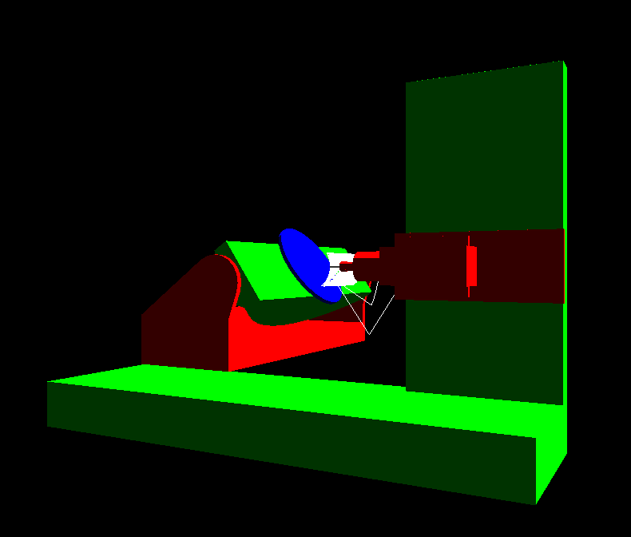

#5 axis milling with Rotation tool center point (RTCP) for a dumb milling machine

This porject is still in progress, for now there isn't any documentation 

#Dependencies: 
    Python 3.x
        OpenGL
        pygame

#Usage:
- nclReader.py read from a ncl  file with tool position and oreintation (x,y,z,i,j,k) coming from Creo and write a nc file with corrected position (x',y',z',a,b) wich can be read by mach3, UcCNC, linuxCNC ...

    'L77 :reader.translate(<input ncl file>,< output nc file>)'

-stl control.py  read the "assets/finition.nc" and moove the machine according to the (x',y',z',a,b)

4r19415@gmail.com if you have any question